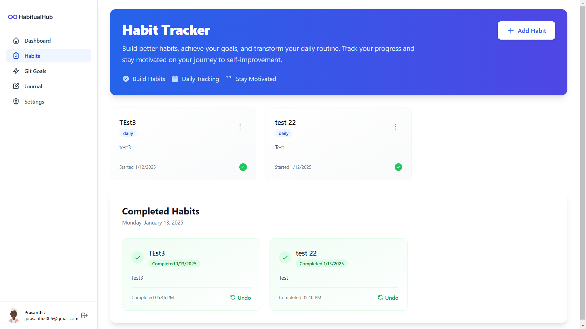
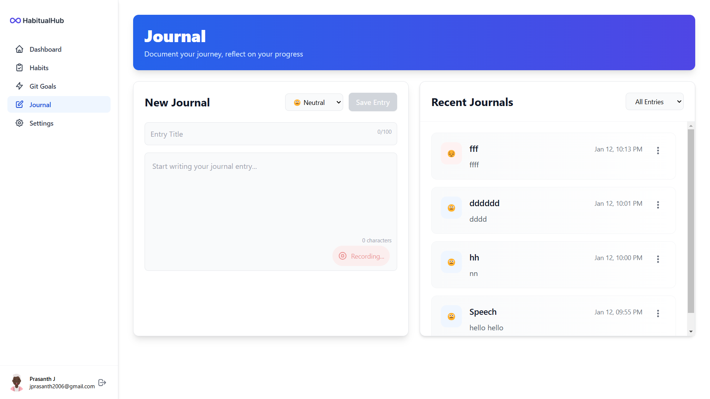
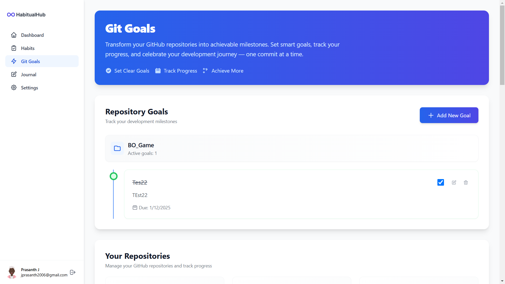

# 

# **HabitualHub: Your Personal Productivity Companion**
🚀 **Live Demo**: [HabitualHub](https://habitualhub-frontend.onrender.com/)

---

## 📚 **About the Project**  
**HabitualHub** is a productivity-focused app designed to help users embark on new beginnings with ease and organization. Whether you're aiming to form new habits, set achievable goals, or reflect on daily progress, HabitualHub empowers you to take charge of your productivity journey.

---

## 📸 **App Screenshots**  
Here are some screenshots of HabitualHub in action:

### 1. Habit Tracker Screen


### 2. Voice-to-Text Journaling


### 3. Goal Setting Dashboard


---

## 🛠️ **Tech Stack**  
### **Frontend**  
- React  
- Vite  
- Tailwind CSS  

### **Backend**  
- Node.js  
- Express  
- MongoDB  

### **Deployment**  
- Render (Frontend and Backend)  

---

## 🤖 **How GitHub Copilot Helped**  
GitHub Copilot AI played an instrumental role in the development of HabitualHub. Here's how:  
1. **Code Suggestions and Autocomplete**:  
   - Copilot provided intelligent autocompletion for repetitive code blocks like form creation, validation logic, and API integration.  
   - **Time Savings**: Copilot reduced the coding time for creating standard components by **30%**, allowing more time for refining features and UI.

2. **Error Handling**:  
   - It suggested try-catch blocks and provided error-handling patterns for both frontend and backend.  
   - This feature helped minimize bugs during development and saved hours spent on debugging.

3. **UI Component Snippets**:  
   - While building the frontend, Copilot generated boilerplate code for React components and Tailwind CSS classes, speeding up development.  

4. **Efficient Backend Development**:  
   - Suggested RESTful API patterns for CRUD operations, including route and controller structures.  
   - **Time Savings**: Copilot enabled quicker backend setup, reducing setup time by **20%**.

5. **Debugging and Optimization**:  
   - Highlighted areas where code could be optimized, such as minimizing re-renders in React and improving database query efficiency.

6. **Voice-to-Text Feature Implementation**:  
   - Provided guidance and snippets for integrating Web Speech API for voice recognition.  
   - This feature would have taken longer to implement manually, but Copilot’s suggestions expedited the process.

**Metrics**:  
- **30%** time saved on coding standard components.  
- **20%** faster backend development.  
- Improved overall code quality and minimized errors by providing real-time suggestions.

You can learn more about GitHub Copilot and its features [here](https://copilot.github.com/).

---

## ⚙️ **Setup and Installation**  
### Prerequisites  
- [Node.js](https://nodejs.org/) installed on your machine.  

### **1. Clone the Repository**  
```bash
git clone https://github.com/PrasanthYT/habitualhub.git
cd habitualhub
```

### **2. Install Dependencies**  
- **Frontend**:  
   ```bash
   cd client
   npm install
   npm run dev
   ```
- **Backend**:  
   ```bash
   cd server
   npm install
   npm start
   ```

---

## 🚀 **Live Demo**  
Experience HabitualHub live: [HabitualHub](https://habitualhub-frontend.onrender.com/) 
---

## 📄 **License**  
This project is licensed under the MIT License. See the [LICENSE](LICENSE) file for more details.  

---

## 🌟 **Contributing**  
Contributions are welcome! If you have suggestions or feature requests, feel free to open an issue or submit a pull request.